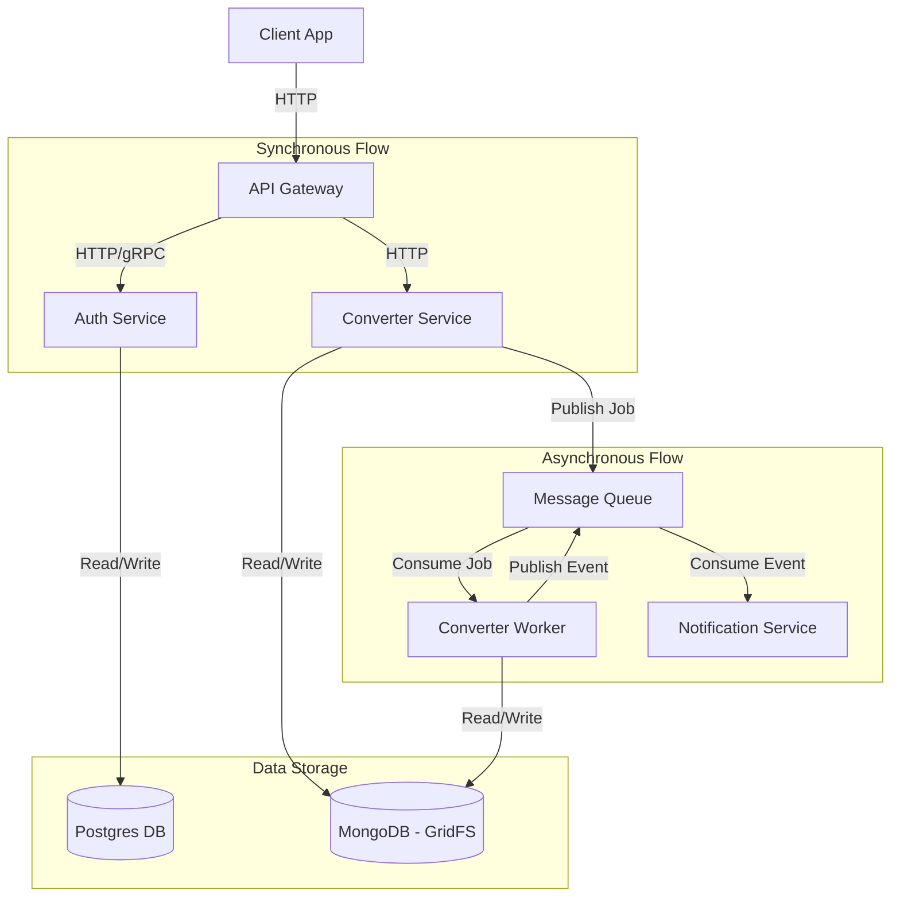

# Architecture Plan: Video to MP3 Converter

## 1. System Overview

The system is a microservices-based application that allows users to upload video files and convert them into MP3 audio files. The architecture is designed to be scalable and decoupled, utilizing asynchronous communication for heavy processing tasks.

## 2. Architecture Diagram (Conceptual)

## 3. Microservices Breakdown

### 3.1. API Gateway

- **Role**: Single entry point for all client requests.
- **Responsibilities**:
  - Request routing.
  - Authentication middleware (validating tokens via Auth Service).
  - Rate limiting.
- **Tech Stack**: NestJS.

### 3.2. Auth Service

- **Role**: Manages user identity and access.
- **Responsibilities**:
  - User registration and login.
  - JWT token generation and validation.
  - Managing user roles.
- **Database**: PostgreSQL (User data, credentials).
- **Tech Stack**: NestJS, TypeORM/Prisma.

### 3.3. Converter Service

- **Role**: Handles file management and media conversion.
- **Responsibilities**:
  - **Upload**: Receive video files and store them.
  - **Conversion**: Convert Video -> MP3.
  - **Storage**: Manage files in MongoDB (using GridFS for large files).
- **Communication**:
  - Publishes `video_uploaded` events to the Queue.
  - Consumes conversion jobs.
- **Database**: MongoDB (File storage, Metadata).
- **Tech Stack**: NestJS, Mongoose, fluent-ffmpeg.

### 3.4. Notification Service

- **Role**: Notifies users about system events.
- **Responsibilities**:
  - Listen for `conversion_completed` or `conversion_failed` events.
  - Send emails or push notifications to users.
- **Tech Stack**: NestJS, Nodemailer (or similar).

## 4. Infrastructure & Communication

### 4.1. Message Queue

- **Technology**: RabbitMQ.
- **Purpose**: Decouple the upload process from the conversion process. Ensure reliability and load leveling.

### 4.2. Databases

- **PostgreSQL**: Relational data (Users, Auth).
- **MongoDB**: Unstructured data (File metadata) and Blob storage (Video/Audio binaries via GridFS).

### 4.3. Containerization

- **Docker**: Each service will have its own Dockerfile.
- **Docker Compose**: For local development orchestration.
